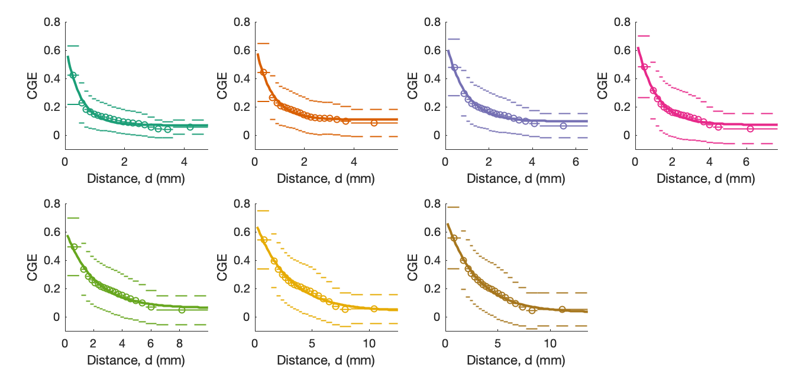
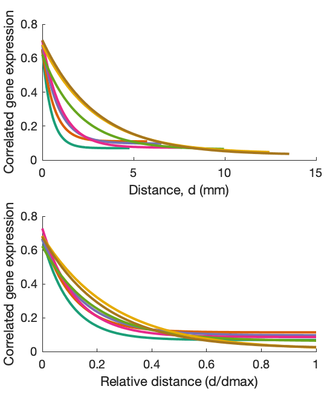
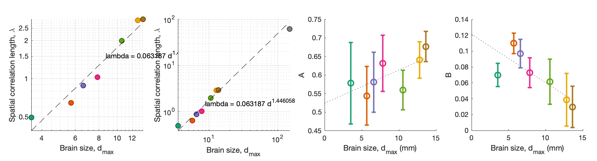

# Analysing the spatial embedding of gene expression across mouse brain development

Code for reproducing analyses presented in:
H.Y.G. Lau, B.D. Fulcher, A. Fornito. [Scaling of gene transcriptional gradients with brain size across mouse development](https://doi.org/10.1101/2020.06.04.135525), _bioRxiv_ (2020).

Data analysis is here; code for the simple physical model is in [this repo](https://github.com/NeuralSystemsAndSignals/DevelopmentalExpressionModeling).

Data was taken from the Allen Institute's [Developing Mouse Brain Atlas](https://developingmouse.brain-map.org/) using python scripts that call the [AllenSDK](https://allensdk.readthedocs.io/) (in `DataRendering`). The retrieved data fills the `Data/API` directory. Detailed steps as follow:
* Download Allen API package by `pip install allensdk`
* Run `download_devmouse_unionizes.py` to retrieve gene expression data at structure level
* Run `structures.py` to download structure information
* Run `getBrainDivision.py` to download major brain division info (forebrain, midbrain and hindbrain) and ID of their descendants; data saved in `structure_F.csv`, `structure_M.csv`,`structure_H.csv`,`structure_F_descendant_ID.csv`,`structure_M_descendant_ID.csv`,`structure_H_descendant_ID.csv`

Processed data is available from [this figshare repository](https://figshare.com/projects/Developing_Mouse/64328), and can be downloaded to reproduce the results presented in our paper (using the functions outlined below). Please save them to the "Matlab_variables" folder.

Before running analyses, add all repository paths using `startup`.

<!-- ### Figure 1
`makeFigure1()`

 -->

### CGE Curves

`makeCGECurves()`

Yields Fig. 2:

And Fig. 3:

### Scaling relationships

`makeParameterScalingFig()`

Produces the plots of parameter scaling in Fig. 4:

### Voxel sampling

Supplementary Fig. S1:

`makeFigureS1()`

## Data processing

The data processing steps are contained in `createData()`, which generates processed data starting from `energyGrids` `.mat` variables.

* Fills the `Matlab_variables` directory
* To create most of the data, either run `createData()` to create data starting from energyGrids `.mat` variables, or `createData(true)` to create from the raw data
* Run `createVariance.m` to create the data of variance in decay constant against number of data points used (takes a long time, >24h)
