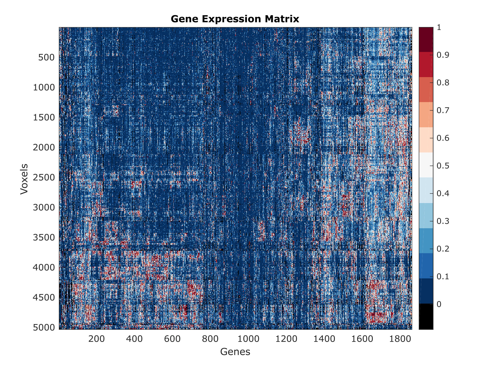
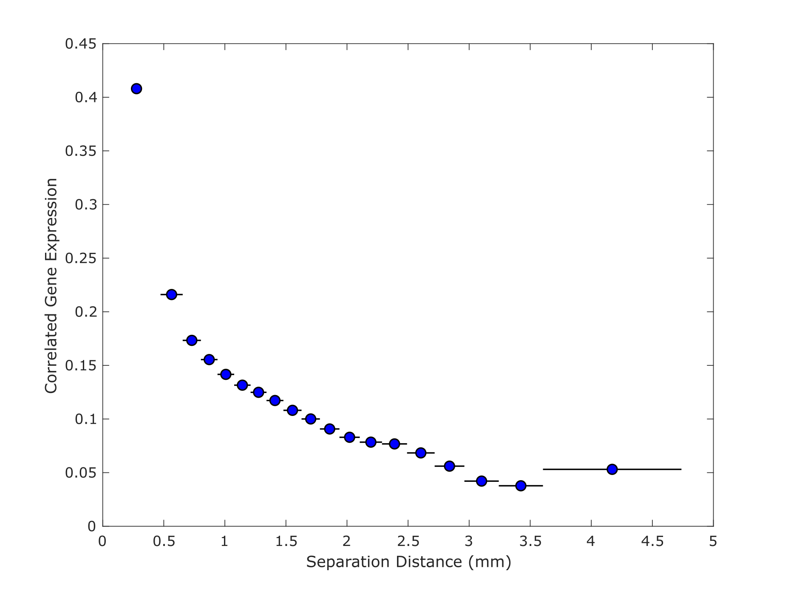
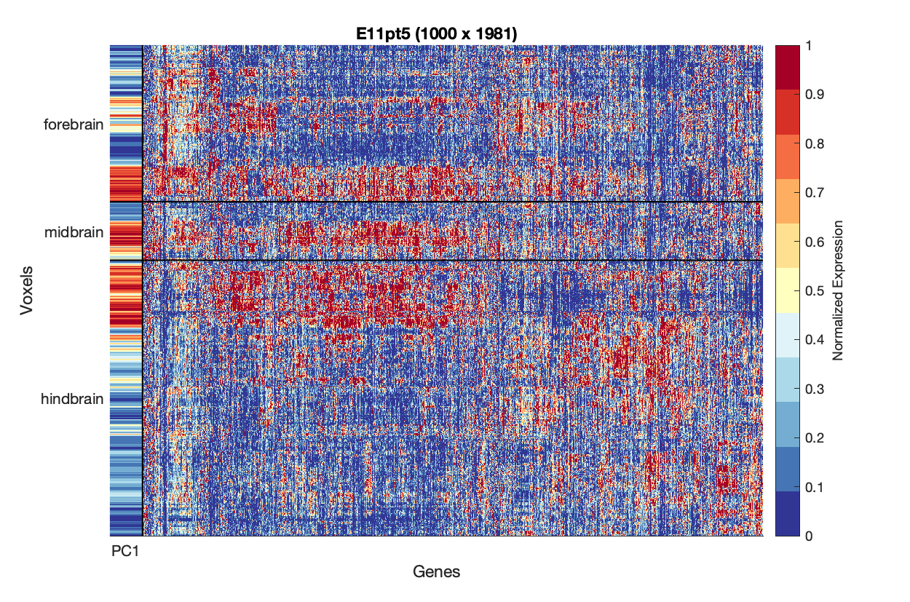
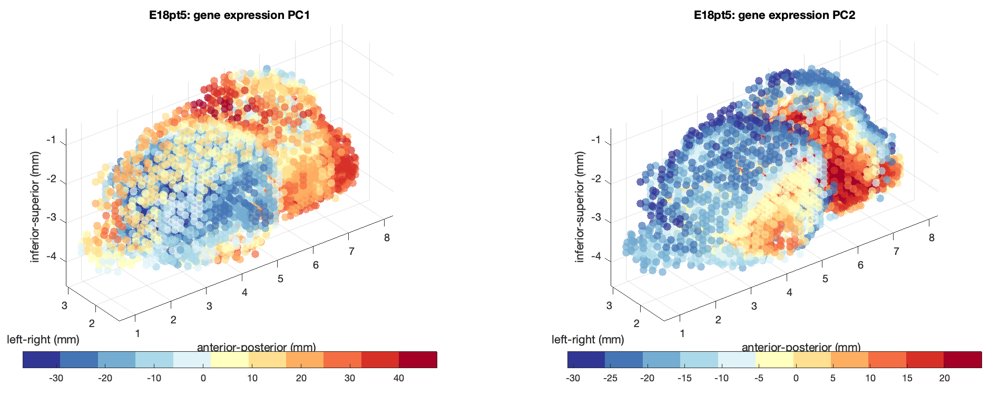
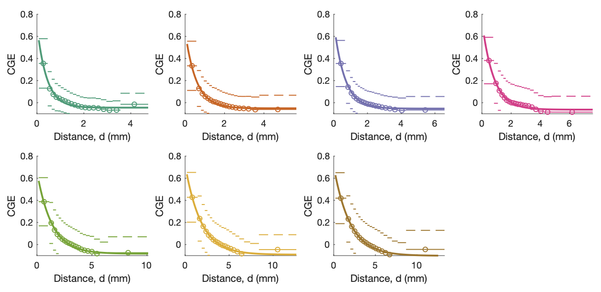
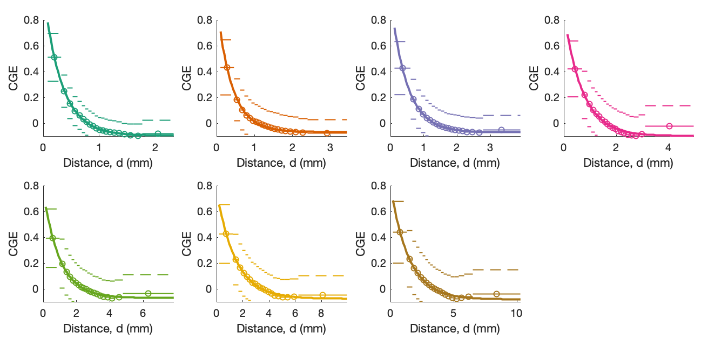
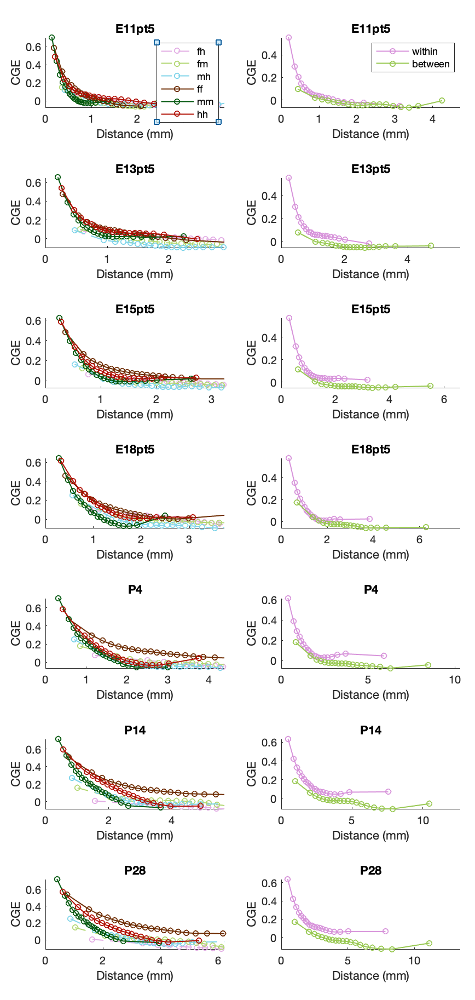
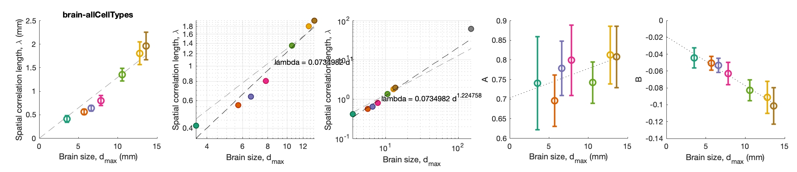
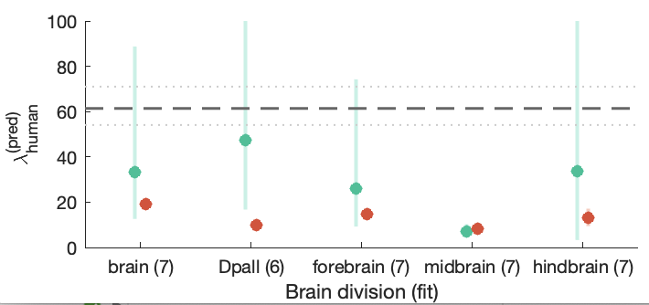
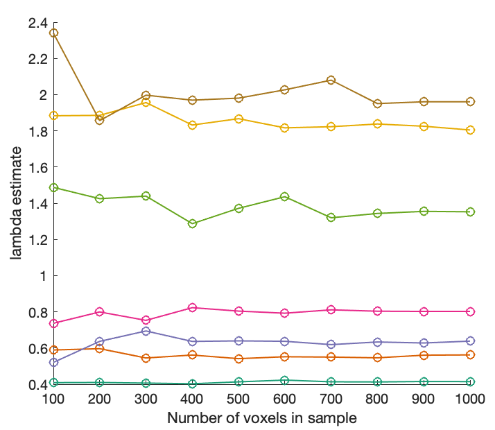

# Scaling of gene transcriptional gradients with brain size across mouse development

This repository contains Matlab and python code for reproducing analyses presented in the open-access journal article:

&#x1F4D7;
H.Y.G. Lau, A. Fornito, B.D. Fulcher. [Scaling of gene transcriptional gradients with brain size across mouse development](https://doi.org/10.1016/j.neuroimage.2020.117395), _NeuroImage_ __224__: 117395 (2021).

Additional code to reproduce simulations of a simple physical model is in [this GitHub repo](https://github.com/ DynamicsAndNeuralSystems /DevelopmentalExpressionModeling).

Data was taken from the Allen Institute's [Developing Mouse Brain Atlas](https://developingmouse.brain-map.org/) using python scripts that call the [AllenSDK](https://allensdk.readthedocs.io/) (in `DataRendering`).

A description of the raw data retrieval via the Allen SDK is at the bottom of this document.

Processed data is available from [this Zenodo data repository](https://doi.org/10.5281/zenodo.4620135), and can be downloaded to reproduce the results presented in our paper (using the functions outlined below).
(FYI: a previous related dataset was uploaded to [this figshare repository](https://figshare.com/projects/Developing_Mouse/64328)).

<!-- ### Figure 1
`makeFigure1()`


 -->

## Results

Before running analyses, add all repository paths using `startup`.

### Plotting voxel expression data

#### Clustered gene-expression matrices

You can get the clustered gene-expression plots as:
```matlab
PlotAllExpressionMatrices
```
Or for each individual one, as, e.g., `PlotExpressionMatrix('E11pt5')`.
Saves to `Outs/ExpressionMatrix_E11pt5.png`:



#### Three-dimensional voxel principal components

```matlab
PlotAll3dSpatial
```
And individual time points as `VisualizeSpatialExpression`.

For example, taking E18.5 (without distinguishing fore/mid/hindbrain) and subsampling to 5000 voxels we can see the two gene-expression PCs for the left hemisphere in three-dimensional space:
```matlab
VisualizeSpatialExpression('E18pt5','','turboOne',5000)
```



### CGE(_d_) Curves

```matlab
makeCGECurves()
```

Yields Fig. 3:



#### Dependence on anatomical subdivisions:

We can also modify the data used for these computations, including subsets of voxels and/or genes.

For example, to compute the same curves but only using forebrain voxels and neuron-enriched genes:

```matlab
params = GiveMeDefaultParams();
params.thisBrainDiv = 'forebrain';
params.thisCellType = 'neuron';
makeCGECurves(params)
```



#### Contributions from voxels within or between major anatomical subdivisions

We can also investigate the contribution of pairs of voxels within and between major anatomical divisions in one go:

```matlab
params = GiveMeDefaultParams();
WithinBetween(params,true,true,true);
```



You can get clearer individual figures by saving each individual time point to a separate figure as: `WithinBetween(params,true,false,true);`.

### Scaling relationships

First compute the exponential fitting results using `ComputeFittingResults`.

Then you can visualize the results as:
```matlab
makeConstantPlot();
```

Produces the plots of parameter scaling:



### Human prediction
You can use mouse data to make predictions about the spatial transcriptional correlation length in human:

```matlab
PredictHuman();
```



The dependence of lambda estimates on voxel subsampling can be assessed as:

```matlab
VoxelSamplingDependence()
```



## Data

### Raw data retrieval

Raw data was retrieved via the API made available using the Allen SDK.
Code is available in this repository:

1. Download Allen API package by `pip install allensdk`
2. Run `download_devmouse_unionizes.py` to retrieve gene expression data at structure level
3. Run `structures.py` to download structure information
4. Run `getBrainDivision.py` to download major brain division info (forebrain, midbrain and hindbrain) and ID of their descendants; data saved in `structure_F.csv`, `structure_M.csv`,`structure_H.csv`,`structure_F_descendant_ID.csv`,`structure_M_descendant_ID.csv`,`structure_H_descendant_ID.csv`.

### Processing of raw data

The processed data files were obtained by running `createData(false)`, which creates data files starting from `energyGrids.mat` variables (downloaded from [this figshare repository](https://figshare.com/projects/Developing_Mouse/64328).

The full pipeline from raw data (downloaded via the Allen SDK) can be reproduced using `createData(true)`.

You can also run `createVariance` to create the data of variance in decay constant against number of data points used (takes a long time, >24h).
