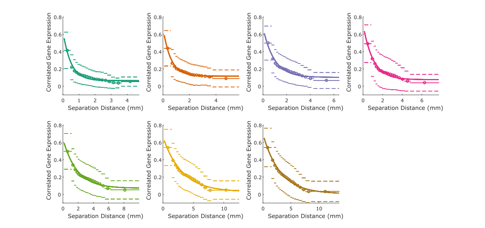
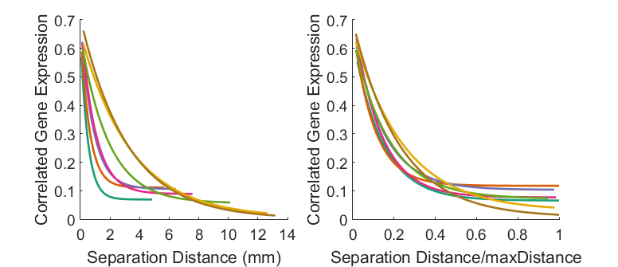
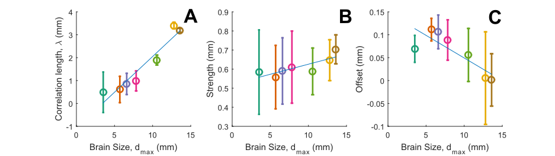
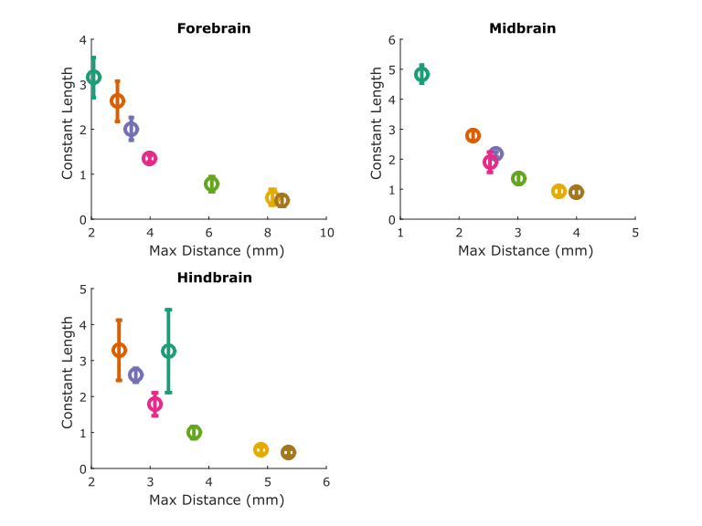
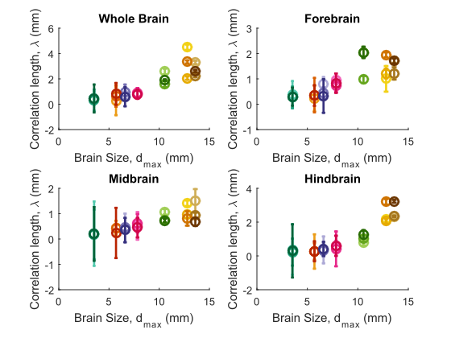
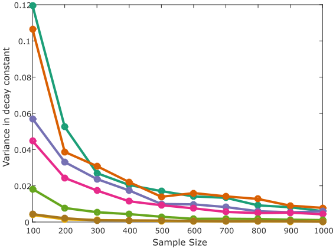
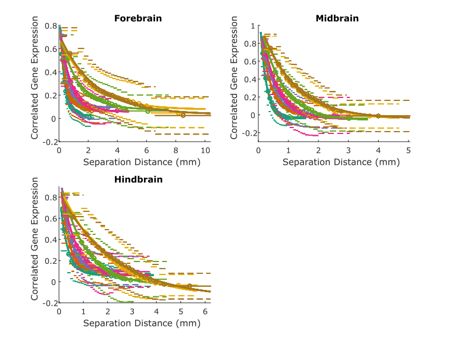
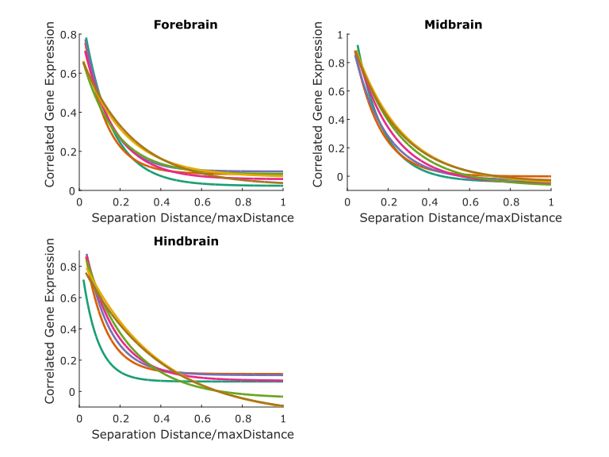
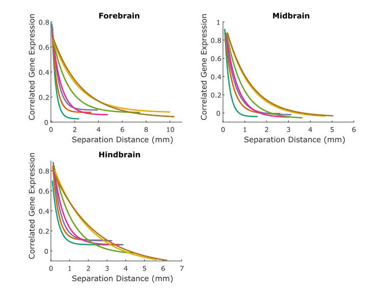

# Developing Mouse Scripts

## Retrieve data
### Raw data from Allen API (NOT YET REPLICATED)
* Fills the `Data/API` directory.
* First download Allen API package by `pip install allensdk`
* Run `download_devmouse_unionizes.py` to retrieve gene expression data at structure level (tentative)
* Run `structures.py` to download structure information
* Run `getBrainDivision.py` to download major brain division info (forebrain, midbrain and hindbrain) and ID of their descendants; data saved in `structure_F.csv`, `structure_M.csv`,`structure_H.csv`,`structure_F_descendant_ID.csv`,`structure_M_descendant_ID.csv`,`structure_H_descendant_ID.csv`
### download preprocessed data
* Fill the `Matlab_variables` directory with data from [this](https://drive.google.com/file/d/1Bw0frIZqJuTZCW797K-CUV1bVU1KG8eL/view?usp=sharing) Google Drive
* The Data processing step below can be skipped, or you can run `createData()` to create data starting from energyGrids .mat variables

## Data processing
* Fills the `Matlab_variables` directory
* To create most of the data, either run `createData()` to create data starting from energyGrids `.mat` variables, or `createData(true)` to create from the raw data
* Run `createVariance.m` to create the data of variance in decay constant against number of data points used (takes a long time, >24h)

## Figures
Either create single figures by running each of the separate functions below, or create all figures at once by running `createFigures.m`

### Figure 1
`makeFigure1()`

### Figure 2A-I
`makeFigure2()`

### Figure 3A-C
`makeFigure3()`

### Figure 4A-C
`makeFigure4()`

### Figure 5A-D
`makeFigure5()`

### Figure S1
`makeFigureS1()`

### Figure S2A-I
`makeFigureS2()`

* All figures are saved in Outs/figure(number)
